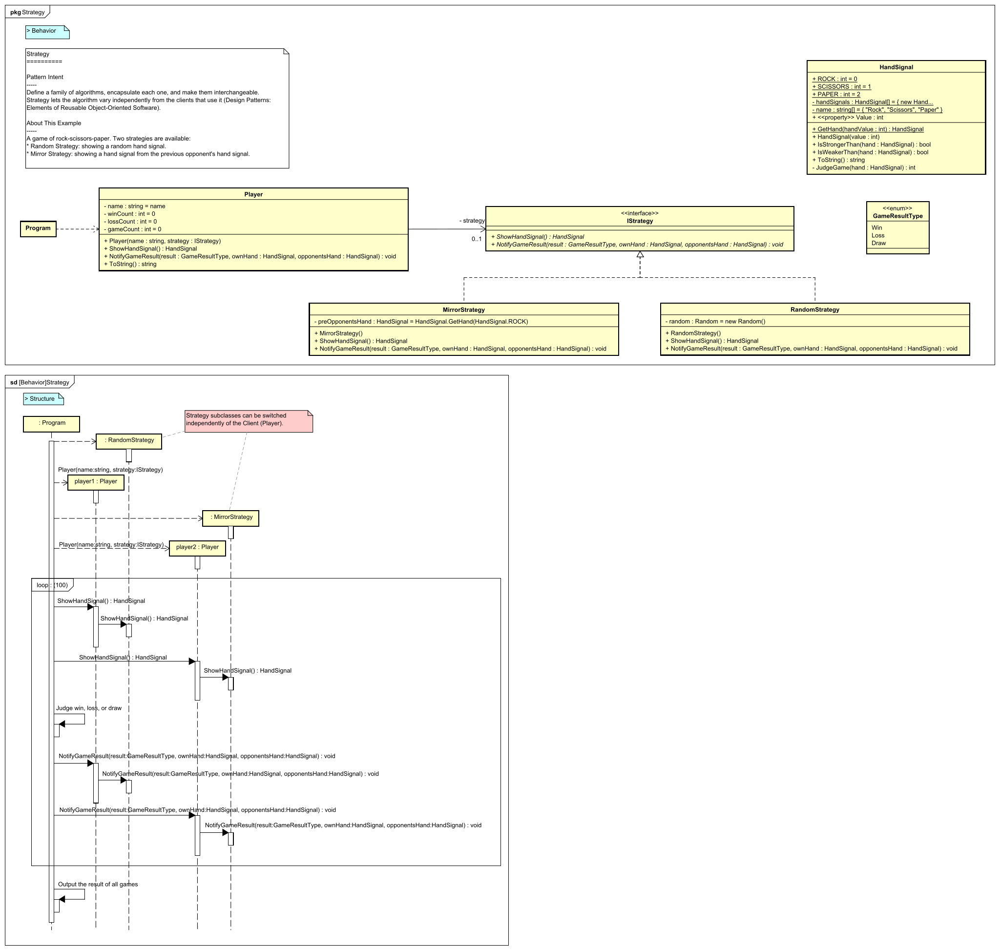
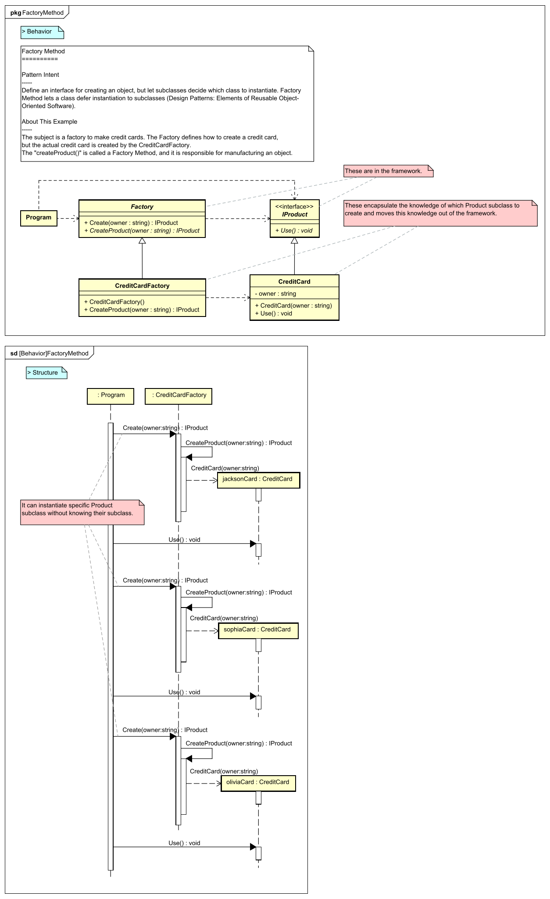

UML Diagram for C# Design Pattern Examples
===

This project lists UML diagrams of the "[Design Pattern Examples in C#](https://github.com/takaakit/design-pattern-examples-in-csharp)". When you click on a diagram image, the diagram will be opened in **Diagram Map**. If you want to know about Diagram Map, see [this post](https://dev.to/takaakit/diagram-map-tracing-uml-sysml-elements-across-diagrams-49i7).

Behavioral Patterns
---
|  |  |  |
| :---: | :---: | :---: |
| **Chain of Responsibility** | **Command** | **Interpreter** |
|  <a href="https://github.com/takaakit/design-pattern-examples-in-csharp/tree/master/BehavioralPatterns/ChainOfResponsibility">C# Code</a> <a href="./BehavioralPatterns/ChainOfResponsibility/ExecutionResult.png">Execution Result</a> |  <a href="https://github.com/takaakit/design-pattern-examples-in-csharp/tree/master/BehavioralPatterns/Command">C# Code</a> <a href="./BehavioralPatterns/Command/ExecutionResult.png">Execution Result</a> |  <a href="https://github.com/takaakit/design-pattern-examples-in-csharp/tree/master/BehavioralPatterns/Interpreter">C# Code</a> <a href="./BehavioralPatterns/Interpreter/ExecutionResult.png">Execution Result</a> |
| **Iterator** | **Mediator** | **Memento** |
|  <a href="https://github.com/takaakit/design-pattern-examples-in-csharp/tree/master/BehavioralPatterns/Iterator">C# Code</a> <a href="./BehavioralPatterns/Iterator/ExecutionResult.png">Execution Result</a> |  <a href="https://github.com/takaakit/design-pattern-examples-in-csharp/tree/master/BehavioralPatterns/Mediator">C# Code</a> <a href="./BehavioralPatterns/Mediator/ExecutionResult.png">Execution Result</a> |  <a href="https://github.com/takaakit/design-pattern-examples-in-csharp/tree/master/BehavioralPatterns/Memento">C# Code</a> <a href="./BehavioralPatterns/Memento/ExecutionResult.png">Execution Result</a> |
| **Observer** | **State** | **Strategy** |
|  <a href="https://github.com/takaakit/design-pattern-examples-in-csharp/tree/master/BehavioralPatterns/Observer">C# Code</a> <a href="./BehavioralPatterns/Observer/ExecutionResult.png">Execution Result</a> |  <a href="https://github.com/takaakit/design-pattern-examples-in-csharp/tree/master/BehavioralPatterns/State">C# Code</a> <a href="./BehavioralPatterns/State/ExecutionResult.png">Execution Result</a> |  <a href="https://github.com/takaakit/design-pattern-examples-in-csharp/tree/master/BehavioralPatterns/Strategy">C# Code</a> <a href="./BehavioralPatterns/Strategy/ExecutionResult.png">Execution Result</a> |
| **Template Method** | **Visitor** |  |
|  <a href="https://github.com/takaakit/design-pattern-examples-in-csharp/tree/master/BehavioralPatterns/TemplateMethod">C# Code</a> <a href="./BehavioralPatterns/TemplateMethod/ExecutionResult.png">Execution Result</a> |  <a href="https://github.com/takaakit/design-pattern-examples-in-csharp/tree/master/BehavioralPatterns/Visitor">C# Code</a> <a href="./BehavioralPatterns/Visitor/ExecutionResult.png">Execution Result</a> |  |

Creational Patterns
---
|  |  |  |
| :---: | :---: | :---: |
| **Abstract Factory** | **Builder** | **Factory Method** |
|  <a href="https://github.com/takaakit/design-pattern-examples-in-csharp/tree/master/CreationalPatterns/AbstractFactory">C# Code</a> <a href="./CreationalPatterns/AbstractFactory/ExecutionResult.png">Execution Result</a> |  <a href="https://github.com/takaakit/design-pattern-examples-in-csharp/tree/master/CreationalPatterns/Builder">C# Code</a> <a href="./CreationalPatterns/Builder/ExecutionResult.png">Execution Result</a> |  <a href="https://github.com/takaakit/design-pattern-examples-in-csharp/tree/master/CreationalPatterns/FactoryMethod">C# Code</a> <a href="./CreationalPatterns/FactoryMethod/ExecutionResult.png">Execution Result</a> |
| **Prototype** | **Singleton** |  |
|  <a href="https://github.com/takaakit/design-pattern-examples-in-csharp/tree/master/CreationalPatterns/Prototype">C# Code</a> <a href="./CreationalPatterns/Prototype/ExecutionResult.png">Execution Result</a> |  <a href="https://github.com/takaakit/design-pattern-examples-in-csharp/tree/master/CreationalPatterns/Singleton">C# Code</a> <a href="./CreationalPatterns/Singleton/ExecutionResult.png">Execution Result</a> |  |

Structural Patterns
---
|  |  |  |
| :---: | :---: | :---: |
| **Adapter** | **Bridge** | **Composite** |
|  <a href="https://github.com/takaakit/design-pattern-examples-in-csharp/tree/master/StructuralPatterns/Adapter">C# Code</a> <a href="./StructuralPatterns/Adapter/ExecutionResult.png">Execution Result</a> |  <a href="https://github.com/takaakit/design-pattern-examples-in-csharp/tree/master/StructuralPatterns/Bridge">C# Code</a> <a href="./StructuralPatterns/Bridge/ExecutionResult.png">Execution Result</a> |  <a href="https://github.com/takaakit/design-pattern-examples-in-csharp/tree/master/StructuralPatterns/Composite">C# Code</a> <a href="./StructuralPatterns/Composite/ExecutionResult.png">Execution Result</a> |
| **Decorator** | **Facade** | **Flyweight** |
|  <a href="https://github.com/takaakit/design-pattern-examples-in-csharp/tree/master/StructuralPatterns/Decorator">C# Code</a> <a href="./StructuralPatterns/Decorator/ExecutionResult.png">Execution Result</a> |  <a href="https://github.com/takaakit/design-pattern-examples-in-csharp/tree/master/StructuralPatterns/Facade">C# Code</a> <a href="./StructuralPatterns/Facade/ExecutionResult.png">Execution Result</a> |  <a href="https://github.com/takaakit/design-pattern-examples-in-csharp/tree/master/StructuralPatterns/Flyweight">C# Code</a> <a href="./StructuralPatterns/Flyweight/ExecutionResult.png">Execution Result</a> |
| **Proxy** |  |  |
|  <a href="https://github.com/takaakit/design-pattern-examples-in-csharp/tree/master/StructuralPatterns/Proxy">C# Code</a> <a href="./StructuralPatterns/Proxy/ExecutionResult.png">Execution Result</a> | | |

References
---
* Gamma, E. et al. Design Patterns: Elements of Reusable Object-Oriented Software, Addison-Wesley, 1994
* Hiroshi Yuki. Learning Design Patterns in Java [In Japanese Language], Softbank publishing, 2004

Links
---
* [Design Pattern Examples in C#](https://github.com/takaakit/design-pattern-examples-in-csharp)
* [Diagram Map: tracing UML/SysML elements across diagrams](https://dev.to/takaakit/diagram-map-tracing-uml-sysml-elements-across-diagrams-49i7)

Licence
---
Diagram Map file (DiagramMap.html) includes the following libraries:
* [D3 library](https://d3js.org) is copyrighted by Mike Bostock and is released under the [BSD license](https://opensource.org/licenses/BSD-3-Clause).
* [Popper library](https://popper.js.org/) is copyrighted by Federico Zivolo and is released under the [MIT license](https://opensource.org/licenses/MIT).
* [Tippy library](https://atomiks.github.io/tippyjs/) is copyrighted by atomiks and is released under the [MIT license](https://opensource.org/licenses/MIT).

Files and data in this project other than the above libraries are under the [Creative Commons Zero (CC0) license](https://creativecommons.org/publicdomain/zero/1.0/).
